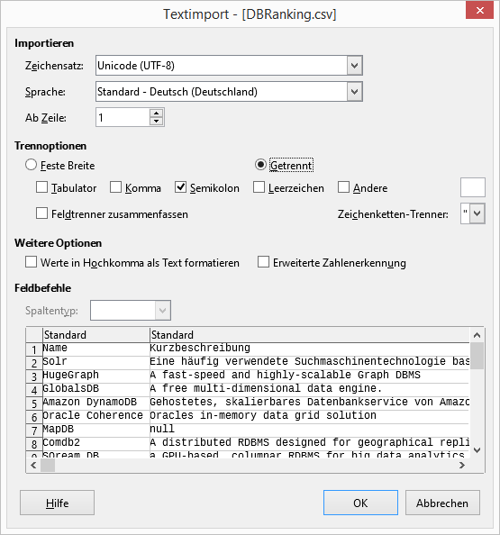

# Parser for https://db-engines.com/

This program is used to collect data from a database ranking provided on the webpage https://db-engines.com.

## How to Use
Build the application using Maven and the provided POM.xml file. Execute the newly created .jar file to execute the parser.

``` bash
mvn clean package
java -jar target/DBEngines-0.0.1-SNAPSHOT-jar-with-dependencies.jar
```
The program collects all database entries and the corresponding URLs from https://db-engines.com/de/systems.

Every listed database will be collected and the given data will be parsed. The output of the parser is a .csv file.

## Import into Excel/LibreOffice

To view to file in a readable form, we can import it into our favorite spreadsheet program, for example Excel or LibreOffice.
We will need to use the correct settings to import the .csv file.

### LibreOffice

Open the .csv with LibreOffice and use the settings, that are shown in the following screenshot:


### Notes
* a semicolon (" ; ") is used to separate the data
* UTF-8 is used to encode the output .csv file